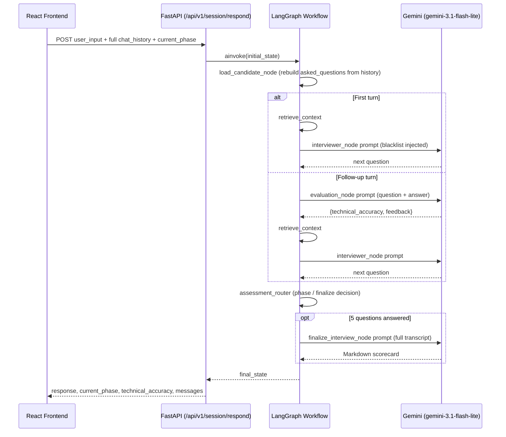
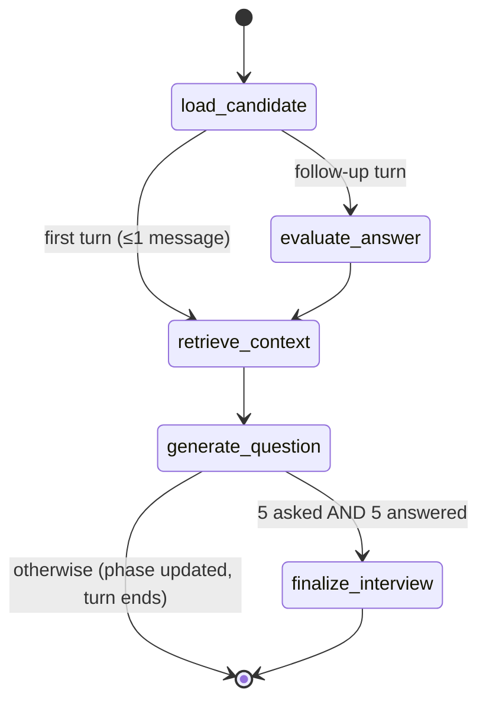

# AI Interview Platform

> A stateful technical-interview engine built on a LangGraph state machine: it asks one question at a time, routes deterministically through interview phases, refuses to repeat a question it has already asked, scores each answer with a schema-constrained LLM call, and closes the session with a generated scorecard.


---

## Overview

Most "AI interviewer" demos are a single prompt wrapped in a chat UI: the model is handed the whole transcript on every turn and asked to improvise. There is no notion of interview phase, no mechanism to stop the model from asking the same question twice, and no separation between *asking* and *grading*.

This project instead treats the interview as an explicit **state machine**, implemented with LangGraph. Each HTTP request carries the running transcript, and the graph deterministically decides — based on how many questions have already been asked and answered — whether to evaluate the previous answer, generate the next question, or finalize the session. Question generation and answer evaluation are separate graph nodes with separate prompts, so grading logic can change without touching how questions are written, and vice versa.

Because the frontend is stateless and re-sends the full chat history on every turn, the backend has no in-memory session to lose: any request with a valid transcript can be resumed from wherever it left off.

---

## What Is Actually Implemented

This README describes the code as it exists in this repository, not an aspirational version of it. Two backend entry points ship in `backend/`:

| Entry point | Wired to frontend? | Status |
|---|---|---|
| `backend/app/main.py` → `app/api/v1/interview.py` → `app/agents/graph.py` | **Yes** — this is what the React app calls | Functional: LangGraph workflow, Gemini-backed question generation and evaluation |
| `backend/main.py` → `app/api/routes.py` → `app/services/interview_service.py` | No | Scaffolded SQLAlchemy session/question/answer layer and a separate FAISS + Jina retrieval pipeline (`app/services/rag_pipeline.py`). References an `app/models` package that is not present in this repo, so this path does not currently import successfully. |

The sections below document the first path in detail, since it is the one that runs end-to-end. The second is called out explicitly in [Known Limitations](#known-limitations--in-progress-work) rather than presented as working, because it isn't wired to anything yet.

---

## Features

### Deterministic Phase Routing

The graph counts AI (`assistant`) and human (`user`) messages in the incoming transcript on every turn and derives the interview phase from that count — it does not ask the model to decide what phase it's in:

```
< 2 questions asked   → warmup
2–3 questions asked   → deep_dive
4th question           → system_design
5 asked AND 5 answered → wrap_up (finalize)
```

This lives in `assessment_router` (`backend/app/agents/graph.py`). Because phase is derived from message counts rather than stored in a database row, a request can be replayed or resumed from any point in the transcript and the graph will land on the correct phase.

### Duplicate Question Prevention

`load_candidate_node` walks the message history on every turn and extracts every prior AI message into an `asked_questions` list. That list is rendered into the question-generation prompt as an explicit blacklist:

```
CRITICAL: Do NOT repeat or ask variations of these questions:
- <question 1>
- <question 2>
...
```

This is prompt-based exclusion, not embedding-based deduplication — the LLM is instructed not to repeat itself, rather than the system algorithmically filtering semantically similar candidates. That distinction is called out in the roadmap below.

### Schema-Constrained Answer Evaluation

`evaluation_node` sends the previous question/answer pair to Gemini with an explicit JSON output contract (`technical_accuracy`, `feedback`) and:

- strips Markdown code fences defensively before parsing,
- validates the parsed object has both required keys,
- validates `technical_accuracy` is a float in `[0.0, 1.0]`,
- falls back to a neutral `0.70` score if parsing or validation fails, rather than guessing from answer length.

The system prompt and user prompt are also separated with explicit `=== ... (untrusted content) ===` delimiters around the candidate's resume, profile, and answer text, with an instruction not to follow instructions embedded in that content — a basic prompt-injection mitigation, since candidate-supplied text is the one part of the payload the server doesn't control.

### Stateless, Replayable Sessions

The graph takes the full chat history on every call and returns the full updated state; nothing is cached server-side between turns. `interview_service.process_interview_turn` (used by the scaffolded SQL path) shows the intended persistence pattern — reconstruct the LangGraph input from stored `Question`/`Answer` rows — but in the currently wired path (`api/v1/interview.py`), the frontend itself is the source of truth for transcript state, which it re-sends on every request.

### Final Scorecard Generation

Once the router determines five questions have been asked and answered, `finalize_interview_node` sends the full transcript, candidate profile, and accumulated evaluation scores to Gemini with instructions to return a fixed-section Markdown report (Executive Summary, Technical Assessment, Strengths, Gaps, Final Recommendation), which is returned to the client and stored as `conversation_summary`.

---

## Architecture

### Request Flow



### LangGraph Workflow



Routing is implemented by two functions in `backend/app/agents/graph.py`:

- `route_entry_path` — decides whether an incoming turn is the opening question or an answer to evaluate, based on transcript length.
- `assessment_router` — runs after question generation, counts AI/human messages, updates `current_phase`, and decides whether to route to `finalize_interview` or end the turn.

### Interview State Shape

`InterviewState` (`backend/app/agents/state.py`) is a `TypedDict` carried through every node:

```python
class InterviewState(TypedDict):
    messages: Annotated[List[AnyMessage], add_messages]  # LangGraph message reducer
    candidate_profile: Dict[str, Any]
    resume_skills: List[str]
    current_phase: Literal["warmup", "deep_dive", "system_design", "wrap_up", "technical"]
    current_topic: str
    covered_topics: List[str]
    difficulty: str
    question_count: int
    asked_questions: List[str]
    question_hashes: List[str]
    retrieved_context: str
    evaluation_scores: Dict[str, Any]
    last_feedback: str
    conversation_summary: str
```

`messages` uses LangGraph's `add_messages` reducer so each node can return only the *new* message it produced, rather than the whole list.

---

## Tech Stack

### Frontend
- React + Vite
- Axios / `fetch` for API calls (`frontend/src/services/`)
- Component-level state only — no client-side persistence layer

### Backend (wired path)
- FastAPI (`backend/app/main.py`)
- LangGraph `StateGraph` (`backend/app/agents/graph.py`)
- LangChain message types (`HumanMessage` / `AIMessage`) as the state's conversation representation
- `langchain-google-genai` → Google Gemini (`gemini-3.1-flash-lite`) for question generation, evaluation, and scorecard generation

### Backend (scaffolded, not yet wired)
- SQLAlchemy models for `InterviewSession` / `Question` / `Answer`
- A FAISS + Jina-embeddings retrieval pipeline (`app/services/rag_pipeline.py`) with async ingestion, role-partitioned indexes, and PDF/TXT chunking
- A regex-based resume parser (`app/services/resume_parser.py`) that extracts skills, technologies, domains, and years of experience from resume text

---

## Repository Structure

```text
frontend/
    src/
        components/         # ScorecardView, QuestionCard, ResumeUpload, etc.
        pages/               # HomePage, InterviewPage
        services/            # interviewApi.js — talks to /api/v1/session/respond

backend/
    main.py                  # Entry point A: SQL-backed FastAPI app (routes.py) — not currently importable, see Limitations
    app/
        main.py               # Entry point B: LangGraph FastAPI app — this is what the frontend calls
        agents/
            state.py           # InterviewState TypedDict
            nodes.py            # load_candidate, retrieve_context, interviewer, evaluation, finalize nodes
            graph.py            # StateGraph wiring + routing functions
        api/
            routes.py           # SQL-backed router (scaffolded, unused by frontend)
            v1/interview.py     # LangGraph-backed router (used by frontend)
        services/
            interview_service.py  # SQL + LangGraph orchestration (scaffolded)
            resume_parser.py      # Regex-based resume skill extraction (scaffolded)
            rag_pipeline.py       # FAISS/Jina retrieval pipeline (scaffolded, unused)
        core/
            config.py            # pydantic-settings, reads .env
    scripts/
        ingest_kb.py            # CLI for rag_pipeline ingestion (currently calls a method rag_pipeline.py doesn't define)
    knowledge_base/
        backend_engineer.txt
    vector_store/                # FAISS index output directory (created at runtime)
```

---

## API Reference

Endpoints actually exposed by the running app (`backend/app/main.py`, prefix `/api/v1`):

| Method | Endpoint | Description |
|---|---|---|
| `GET` | `/` | Liveness check, returns `{"status": "healthy", "engine": "LangGraph Active"}` |
| `POST` | `/api/v1/resume/upload` | Accepts a `.pdf` or `.txt` file, saves it to `backend/uploads/`. Does **not** currently parse the file or feed it into `candidate_profile` — see Limitations. |
| `POST` | `/api/v1/session/respond` | Body: `{ user_input, chat_history: [{role, content}], current_phase }`. Runs one full LangGraph turn and returns the next question, updated phase, evaluation score, and (on the final turn) the scorecard. |

---

## Environment Variables

```bash
# .env.example

# Required for the wired LangGraph path
GEMINI_API_KEY=your_gemini_api_key_here

# Referenced by the scaffolded retrieval/persistence path (app/services/*, backend/main.py)
DATABASE_URL=sqlite+aiosqlite:///./local_storage_do_not_commit.db
OPENAI_API_KEY=your_openai_api_key_here
JINA_API_KEY=your_jina_api_key_here
QDRANT_URL=your_qdrant_cluster_url_here
QDRANT_API_KEY=your_qdrant_api_key_here
```

`GEMINI_API_KEY` is the only variable required to run the app that the frontend actually talks to — `backend/app/agents/nodes.py` raises at import time if it's missing. The remaining variables are consumed by the scaffolded SQL/RAG services and are not required for the demo path.

---

## Quick Start

### Backend (LangGraph path — this is what the frontend uses)

```bash
cd backend
python -m venv .venv
.venv\Scripts\activate        # Windows
# source .venv/bin/activate   # macOS/Linux

pip install -r requirements.txt
pip install langgraph langchain-core langchain-google-genai   # not yet pinned in requirements.txt

cp ../.env.example .env
# edit .env and set GEMINI_API_KEY

uvicorn app.main:app --host 127.0.0.1 --port 8000 --reload
```

Health check:

```bash
curl http://127.0.0.1:8000/
```

### Frontend

```bash
cd frontend
npm install
npm run dev
```

The frontend currently points at a hardcoded Codespaces URL in `frontend/src/services/interviewApi.js` and `api.js` (`getBaseUrl()` / `API_BASE_URL`) — update this to `http://127.0.0.1:8000` for local development.

---

## Design Decisions

**Why LangGraph instead of a single prompt loop.** Phase transitions, question generation, and evaluation have different failure modes and different prompts. Modeling them as distinct nodes with an explicit router means each concern can be tested, logged, and modified independently, and the control flow is visible in code (`graph.py`) rather than implicit in a single long prompt.

**Why the graph is invoked stateless, per request.** There is no server-side session cache in the wired path. The entire transcript is reconstructed from what the client sends. This trades a slightly larger request payload for zero risk of server-side state drifting from what the client displays, and makes the backend horizontally scalable without sticky sessions — any instance can service any request.

**Why evaluation is schema-constrained rather than free-text.** A free-text "grade this answer" prompt is hard to parse reliably and easy to break with malformed output. Requiring a fixed JSON shape, validating both the keys and the numeric range, and falling back to a neutral score on any failure keeps a single bad LLM response from crashing a turn or silently corrupting scores.

**Why duplicate prevention is prompt-based instead of embedding-based.** The current implementation injects a literal blacklist of prior questions into the generation prompt. This is simple and requires no additional infrastructure, but it depends on the model actually honoring the instruction and won't catch a semantically identical question phrased differently — a known gap, listed under Roadmap.

**Why two backend entry points exist in one repo.** `backend/main.py` / `routes.py` / `interview_service.py` represent a second iteration toward persistent sessions (SQLAlchemy-backed `InterviewSession`/`Question`/`Answer`) and real retrieval (`rag_pipeline.py`, FAISS + Jina). That iteration is incomplete — it depends on an `app.models` package that isn't present in the repo — so it doesn't currently run. It is kept in the codebase because it's the intended direction for persistence and retrieval, not because it's production-ready today.

---

## Known Limitations & In-Progress Work

Being direct about the current state of the code:

- **Resume upload is not connected to question generation.** `/api/v1/resume/upload` saves the file to disk and returns a success message; it does not parse the file or populate `candidate_profile`/`resume_skills` in the graph state. The regex-based parser in `app/services/resume_parser.py` exists but isn't called from the wired request path.
- **Retrieval is a placeholder.** `retrieval_node` in `agents/nodes.py` returns a string like `"Vetted evaluation criteria and standards related to context: '<first 30 chars of the last message>...'"` — it is not backed by the FAISS/Jina pipeline in `rag_pipeline.py`, which is fully implemented but never imported outside of its own module and `ingest_kb.py`.
- **The SQL persistence path does not currently import.** `backend/main.py` → `app/api/routes.py` → `app/services/interview_service.py` and `resume_parser.py` all import from `app.models.database` / `app.models.schemas`, but no `app/models` package exists in this repository.
- **`ingest_kb.py` calls a method that doesn't exist.** It calls `rag_pipeline.ingest_document(...)`, but `RAGPipeline` only defines the async `ingest_document_async(...)`.
- **No automated test suite.** `test_rag_verify.py` is a manual verification script for the retrieval pipeline, not a pytest suite, and doesn't run in CI.

---

## Roadmap

**Near-term**
- Wire `resume_parser.py` output into `candidate_profile` on session creation.
- Replace `retrieval_node`'s placeholder string with a real call into `rag_pipeline.py`.
- Add the missing `app/models` package (or repoint `routes.py`/`interview_service.py` at the models that already exist) so the SQL-backed path imports.
- Fix or remove `ingest_kb.py`'s call to the non-existent `ingest_document` method.

**Mid-term**
- Persist `InterviewState` per session (Postgres or SQLite) instead of relying on the client to resend the full transcript every turn.
- Move duplicate-question prevention from a prompt blacklist to embedding-similarity filtering, using the embeddings `rag_pipeline.py` already computes.
- Add automated tests around `assessment_router` and `evaluation_node`'s JSON-validation fallback paths.

**Long-term**
- Multi-interviewer evaluation (separate correctness/communication/design scoring passes).
- Configurable interview length and phase weighting per role.
- Swap the hardcoded Codespaces API URL in the frontend for environment-based configuration.

---

## Contributing

1. Fork the repository and create a feature branch.
2. Keep changes to the wired path (`app/main.py` → `api/v1/interview.py` → `agents/`) and the scaffolded path (`backend/main.py` → `routes.py` → `services/`) clearly separated until the latter is repaired — PRs that assume both are functional will fail review.
3. Run the backend locally with `GEMINI_API_KEY` set and verify `/api/v1/session/respond` end-to-end before submitting a PR that touches `agents/`.
4. Open a PR describing which node(s) or router(s) are affected and why.

---

## License

MIT — see `LICENSE`.
